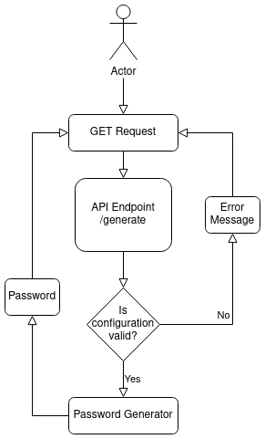

# Random Password Generator Service

This service allows you to randomly generate passwords meeting your specifications, including the password length, between 1 and 200 characters, as well as whether or not to consider numbers, lowercase letters, uppercase letter, and special symbols in the generated password.
To read more about the specifications of the service, feel free to read the [specification document](Python%20Assessment.pdf).
The service is built very efficiently, and is built on an easy to run web app in Python with Flask.
Why not try it out! See [Getting Start](#getting-started) and follow the simple installation to run the service.



## Getting Started

- [Random Password Generator Service](#random-password-generator-service)
  - [Getting Started](#getting-started)
  - [Install](#install)
    - [Install from Docker](#install-from-docker)
    - [Build from Source](#build-from-source)
  - [Deploy](#deploy)
  - [Usage](#usage)
    - [Running the pre-built Docker container](#running-the-pre-built-docker-container)
    - [Running with Docker compose](#running-with-docker-compose)
    - [Running from Source](#running-from-source)
  - [Tests](#tests)
  - [Best Practices](#best-practices)
  - [Acknowledgements](#acknowledgements)

## Install

There are two ways to install the password generator: from [Docker](https://www.docker.com) or by building the source code.

### Install from Docker 

This service has been packaged into a docker container! 
You can find it on the DockerHub at [kevslinger/password-generator](https://hub.docker.com/repository/docker/kevslinger/password-generator).
To download the container, please ensure you have docker installed on your machine.
Then, use the command

```bash
docker pull kevslinger/password-generator
```

### Build from Source

This service can also be built and ran locally without Docker using the provided source code.
First, download the code using

```bash
git clone git@github.com:kevslinger/password-generator.git
```

Then install the dependencies.
For instance, create a virtual environment and use pip3 by running the commands
```bash
cd password-generator
virtualenv venv -p 3.8
source venv/bin/activate
pip3 install -r requirements.txt
```

Now all required python dependencies have been included in the codebase.

## Deploy

If you edit the source code and would like to rebuild the Docker container to include your latest changes, run the command

```bash
docker build --tag kevslinger/password-generator .
```

## Usage

You can run the password generation service from the Docker container or from your local build of the source code.

### Running the pre-built Docker container

To run the Docker container, you can use the following command
```bash
docker run --publish 8080:8080 kevslinger/password-generator
```

This will map the Docker container's port 8080 to your port 8080 and allow you to connect to the service at http://127.0.0.1:8080.

### Running with Docker compose

Alternatively, you can use [Docker compose](https://docs.docker.com/compose/) to run the service.
To do so, download the source code and then use the command `docker compose up`.
An example is provided below

```bash
git clone git@github.com:kevslinger/password-generator.git
cd password-generator
docker compose up
```

The service will build and start, and you can find it by going to htpp://127.0.0.1:8080.

### Running from Source
After building the source code and installing the dependencies, run the following command

```bash
python3 app.py
```

This will launch the service at http://127.0.0.1:8080. To modify the default settings like password length and whether to include lowercase letters, uppercase letters, numbers, or symbols, you can pass in the following arguments:

- `--default-length <length>`
- `--disable-lowercase`
- `--disable-uppercase`
- `--disable-numbers`
- `--disable-symbols`

For instance, if the desired default password length is 50 consisting of only uppercase letters and numbers, run the command

```bash
python3 app.py --default-length 50 --disable-lowercase --disable-symbols
```

## Tests

To run the test suite, which ensures the password generation function meets the input specification, run the following command at the top-level of the repository

```bash
python3 -m pytest
```

## Best Practices

I wrote a web app in Python and HTML using Flask, containerised in Docker, and with automatic testing, continuous integration, and continuous deployment pipeline using GitHub actions and the Docker Hub.
The app features a pragmatic UI and is easy to build from source, Docker, or using Docker Compose. 
The code handles invalid inputs, and a formatted error message is returned to the user upon attempting to generate a password with an invalid configuration.
The server settings are configurable, allowing the maintainers to change the default settings like password length, lowercase/uppercase flags, etc.
Each git commit in this repo's history has a meaningful message describing the changes made throughout the development process.


## Acknowledgements

I'd like to thank the Swisscom team for giving me this interesting project to work on.
I had fun designing and developing it, and even used it practically to generate a new password for one of my accounts!
